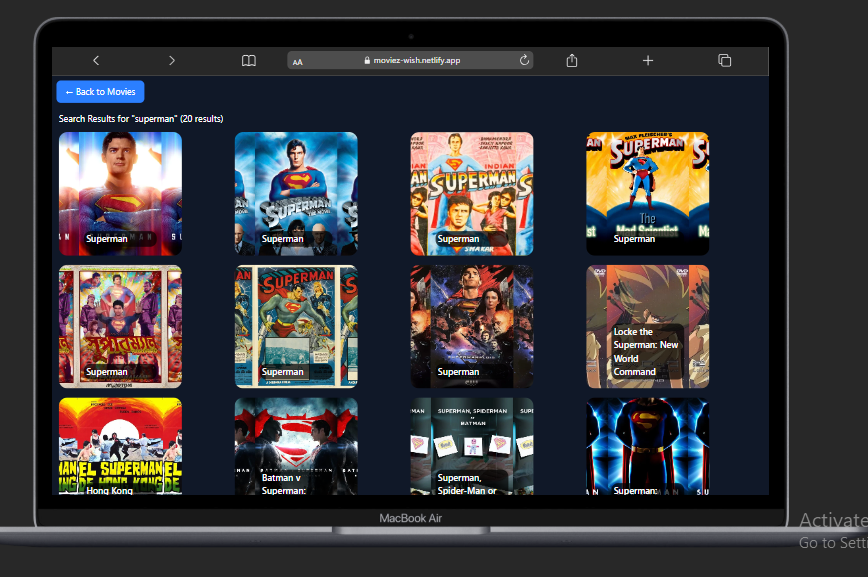
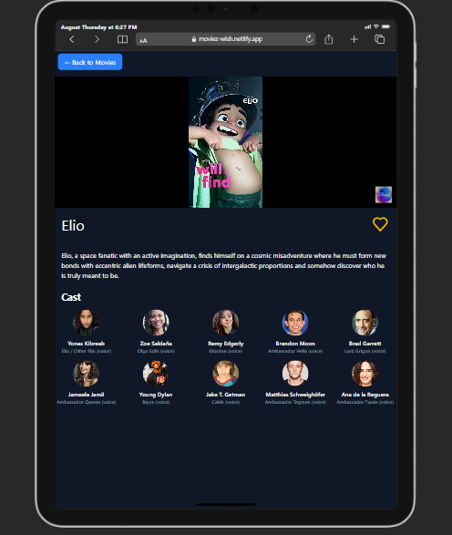
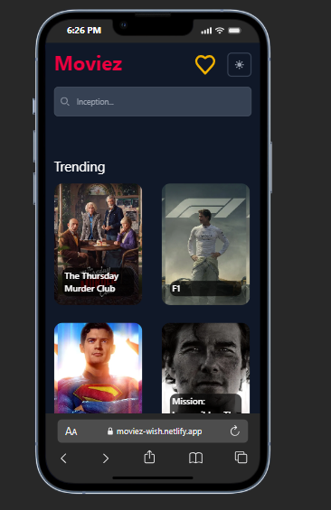

# 🎬 Movie Web App

A modern, responsive movie discovery web application that lets users explore trending and upcoming movies, watch trailers, and manage their personal watchlist.

## ✨ Features

- **🔍 Search Movies** - Find any movie using the powerful TMDB search functionality
- **📊 Trending & Upcoming** - Browse currently trending and upcoming movies
- **🎥 Watch Trailers** - Stream movie trailers directly through YouTube integration
- **📝 Watchlist** - Bookmark movies and manage your personal watchlist
- **📱 Responsive Design** - Optimized for desktop, tablet, and mobile devices
- **🌙 Modern UI** - Clean, intuitive interface with darkmode and lightmode

## 🛠️ Tech Stack

- **Frontend Framework**: Vanilla JavaScript
- **Build Tool**: Vite
- **Styling**: Tailwind CSS + Flowbite Components
- **APIs**: 
  - The Movie Database (TMDB) API
  - YouTube Data API
- **Design**: Custom design with Figma inspiration


## 🚀 Getting Started

### Screenshot






### Prerequisites

- Node.js (v14 or higher)
- npm or yarn
- TMDB API key ([Get one here](https://www.themoviedb.org/settings/api))
- YouTube Data API key ([Get one here](https://developers.google.com/youtube/v3/getting-started))

### Installation

1. **Clone the repository**
   ```bash
   git clone[ https://github.com/yourusername/movie-web-app.git](https://github.com/Jimztech/movie-database-web-app.git)
   cd movie-web-app
   ```

2. **Install dependencies**
   ```bash
   npm install
   ```

3. **Set up environment variables**
   ```bash
   cp .env.example .env
   ```
   
   Edit `.env` and add your API keys:
   ```env
   VITE_MOVIE_API_KEY=your_tmdb_api_key_here
   VITE_YOUTUBE_API_KEY=your_youtube_api_key_here
   ```

4. **Start the development server**
   ```bash
   npm run dev
   ```

5. **Open your browser** and navigate to `http://localhost:5173`

### Build for Production

```bash
npm run build
```

The built files will be in the `dist` directory.

## 🎯 Usage

1. **Browse Movies**: Explore trending and upcoming movies on the homepage
2. **Search**: Use the search bar to find specific movies
3. **Watch Trailers**: Click on any movie to view details and watch trailers
4. **Add to Watchlist**: Bookmark movies you want to watch later
5. **Manage Watchlist**: View and organize your saved movies

## 🔧 Configuration

### Environment Variables

| Variable | Description | Required |
|----------|-------------|----------|
| `VITE_MOVIE_API_KEY` | TMDB API key for fetching movie data | ✅ |

### API Endpoints

The app uses the following TMDB API endpoints:
- `/movie/popular` - Popular movies
- `/movie/upcoming` - Upcoming movies  
- `/trending/movie/week` - Weekly trending movies
- `/search/movie` - Movie search
- `/movie/{id}` - Movie details
- `/movie/{id}/videos` - Movie trailers

## 🎨 Design

The UI design is custom-created with inspiration from modern movie streaming platforms and Figma design systems. Key design principles:

- **Clean & Minimal**: Focus on content with minimal distractions
- **Responsive**: Mobile-first approach with seamless desktop experience  
- **Accessible**: Proper contrast ratios and keyboard navigation
- **Fast**: Optimized images and smooth animations

## 🤝 Contributing

1. Fork the repository
2. Create your feature branch (`git checkout -b feature/AmazingFeature`)
3. Commit your changes (`git commit -m 'Add some AmazingFeature'`)
4. Push to the branch (`git push origin feature/AmazingFeature`)
5. Open a Pull Request

## 📝 License

This project is licensed under the MIT License - see the [LICENSE](LICENSE) file for details.

## 🙏 Acknowledgments

- [The Movie Database (TMDB)](https://www.themoviedb.org/) for the comprehensive movie API
- [YouTube Data API](https://developers.google.com/youtube/v3) for trailer integration
- [Tailwind CSS](https://tailwindcss.com/) for the utility-first CSS framework
- [Flowbite](https://flowbite.com/) for the component library
- [Figma Community](https://www.figma.com/community) for design inspiration

## 📧 Contact

Your Name - [@yourusername](https://twitter.com/yourusername) - your.email@example.com

Project Link: [https://github.com/yourusername/movie-web-app](https://github.com/yourusername/movie-web-app)

---

⭐ If you found this project helpful, please give it a star!